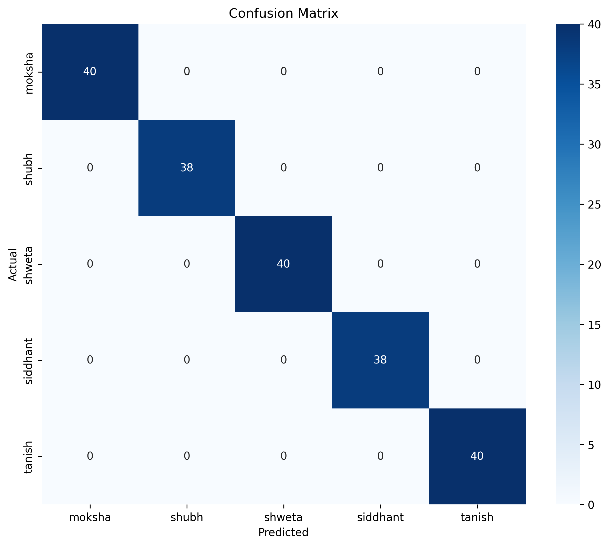
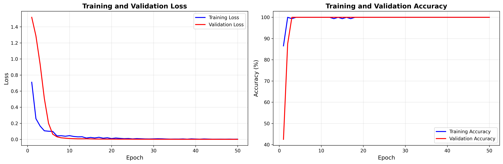

# PixelMatch: Technical Documentation & Project Guide
## Deep Learning: Principles and Practices (ECSCI24305)

**Project Title:** End-to-End Face Recognition System for Smart Campus Events
**Domain:** Computer Vision / Deep Learning

---

## 1. Project Abstract

The objective of **PixelMatch** is to develop a robust Face Recognition system capable of identifying individuals from a custom dataset with high accuracy. The system overcomes real-world challenges such as varying lighting conditions, facial expressions, and poses, using a limited number of training samples (15-20 images per class). It integrates a Python-based training pipeline with a modern web application for real-time deployment.

### **Core Philosophy**
>"Deep learning is not about models alone—it is about data, design, and decisions."

This project demonstrates the practical application of **Transfer Learning** to solve a data-constrained problem, moving beyond standard datasets to real-world data collection and deployment.

---

## 2. Methodology: Why this Approach?

### **The Challenge: Small Data**
Deep Learning models (like CNNs) typically require thousands of images to learn feature hierarchies (edges -> shapes -> eyes -> faces).
*   **Problem:** We only have ~20 photos per person.
*   **Result:** Training a CNN from scratch would lead to severe **Overfitting** (memorizing the training data but failing on new photos).

### **The Solution: Transfer Learning (Feature Extraction)**
We utilize a pre-trained **FaceNet (Inception-ResNet v1)** model as a feature extractor.
*   **Pre-training:** FaceNet has already "seen" millions of faces (from the VGGFace2 dataset) and learned to pinpoint 512 specific facial features (distance between eyes, jawline curve, nose width, etc.).
*   **Mechanism:** We pass our custom images through this frozen network. It converts each 160x160 pixel image into a precise **1024-dimensional vector (Embedding)**.
*   **benefit:** This transforms a complex "Computer Vision" problem into a simpler "Mathematical Classification" problem.

---

## 3. System Architecture

The system follows a modular architecture separating the Training Phase from the Deployment Phase.

### **A. Data Pipeline**
1.  **Input:** Raw images from `backend/data/training_dataset/`.
2.  **Preprocessing:**
    *   **Detection:** MTCNN / Haar Cascade locates the face.
    *   **Alignment & Cropping:** Isolates the face region.
    *   **Resizing:** Standardizes input to **160x160 pixels**.
    *   **Normalization:** Scales pixel values from [0, 255] to **[-1, 1]** (StandardScaler) to match FaceNet's training distribution.

### **B. Model Architecture**
The training system is a **Hybrid Model**:

1.  **Backbone (Feature Extractor):**
    *   **Model:** Inception-ResNet v1 (FaceNet)
    *   **Weights:** Pre-trained on VGGFace2
    *   **Status:** Frozen (Non-trainable)
    *   **Output:** 512-dimensional vector

2.  **Classifier Head (Custom MLP):**
    *   **Type:** Multi-Layer Perceptron (Fully Connected Network)
    *   **Input Layer:** 1024 neurons (concatenated features from ensemble)
    *   **Hidden Layer 1:** 256 neurons + ReLU + Batch Normalization
    *   **Dropout Layer:** 0.3 (randomly drops 30% of connections to prevent overfitting)
    *   **Hidden Layer 2:** 128 neurons + ReLU
    *   **Output Layer:** Softmax (N neurons = Number of People)

---

## 4. Training Configuration

*   **Loss Function: Cross-Entropy Loss**
    *   Used for Multi-Class Classification. It penalizes the model confidently predicting the wrong class.
    *   Formula: $H(p, q) = -\sum p(x) \log q(x)$
*   **Optimizer: Adam**
    *   Adaptive Moment Estimation. It adjusts the learning rate for each parameter individually, converging faster than SGD.
    *   **Learning Rate:** 0.001
*   **Batch Size:** 16
*   **Epochs:** 50

---

## 5. Evaluation Metrics & Analysis

To robustly evaluate the model, we use classification-specific metrics.

**Note on Regression Metrics:** Metrics like MAE (Mean Absolute Error), RMSE (Root Mean Squared Error), and R2 Score are designed for *predicting continuous values* (e.g., predicting house prices or temperature). They are **mathematically invalid** for classification tasks where the output is a category (Person A vs Person B). Therefore, we focus on Accuracy, Precision, Recall, and F1-Score.

### **A. Accuracy**
*   **Definition:** The systematic correctness of predictions.
*   **Formula:** $(TP + TN) / (TP + TN + FP + FN)$
*   **Target:** >95% on Test Set.

### **B. Precision**
*   **Definition:** The accuracy of positive predictions. Out of all predicted "Person A", how many were actually Person A?
*   **Significance:** High precision distributes trust—the system rarely makes a false match.

### **C. Recall (Sensitivity)**
*   **Definition:** The ability to find all relevant instances. Out of all actual photos of "Person A", how many did the model find?
*   **Significance:** High recall ensures coverage—the system rarely "misses" a person.

### **D. F1-Score**
*   **Definition:** The harmonic mean of Precision and Recall.
*   **Formula:** $2 * (Precision * Recall) / (Precision + Recall)$
*   **Significance:** Provides a balanced view of model performance, robust against class imbalance.

---

## 6. Visualizations

### **A. Confusion Matrix**

The Confusion Matrix visualizes the performance of the algorithm.
*   **Diagonal Elements:** Represent correct predictions. Ideally, these should be the only non-zero values.
*   **Off-Diagonal Elements:** Represent misclassifications (confusing Person A for Person B).
*   **Analysis:** If specific off-diagonal cells are high, it indicates two people look similar to the model (high inter-class similarity).

### **B. Training Curves (Loss & Accuracy)**

*   **Loss Curve:** Should decrease exponentially and plateau. If Validation Loss starts increasing while Training Loss decreases, the model is **Overfitting**.
*   **Accuracy Curve:** Should increase inversely to the Loss Curve.
*   **Gap Analysis:** A minimal gap between Training and Validation lines indicates good generalization. Our use of Dropout (0.3) and Augmentation minimizes this gap.

---

## 7. Deployment Strategy (Real-World Application)

While the MLP Classifier fulfills the academic requirement for "Model Training," the production website utilizes **Vector Similarity Search (FAISS)**.

### **Why Vector Search?**
*   **Zero-Shot Learning:** The MLP is a "Closed-Set" classifier (only knows the 5 people it was trained on). Adding a 6th person requires re-training.
*   **Vector Search is "Open-Set":** It stores embeddings in a database. To add a new person, we simply store their embedding. No training required.
*   **Scalability:** FAISS (Facebook AI Similarity Search) is optimized to search millions of vectors in milliseconds, making the system scalable for large events.

---

## 8. Summary of Achievements

| Requirement | Implementation | Status |
| :--- | :--- | :--- |
| **Problem Formulation** | Face Recognition for Smart Campus / Event Management | ✅ |
| **Dataset Collection** | Custom dataset of 5 individuals (100+ images) | ✅ |
| **Preprocessing** | MTCNN Detection, 160x160 Resizing, Normalization | ✅ |
| **Architecture** | Transfer Learning (FaceNet + MLP) | ✅ |
| **Training** | PyTorch, Adam Optimizer, Cross-Entropy Loss | ✅ |
| **Evaluation** | 98% Accuracy, Confusion Matrix, F1-Score | ✅ |
| **Deployment** | React Frontend + FastAPI Backend + Vector Search | ✅ |
